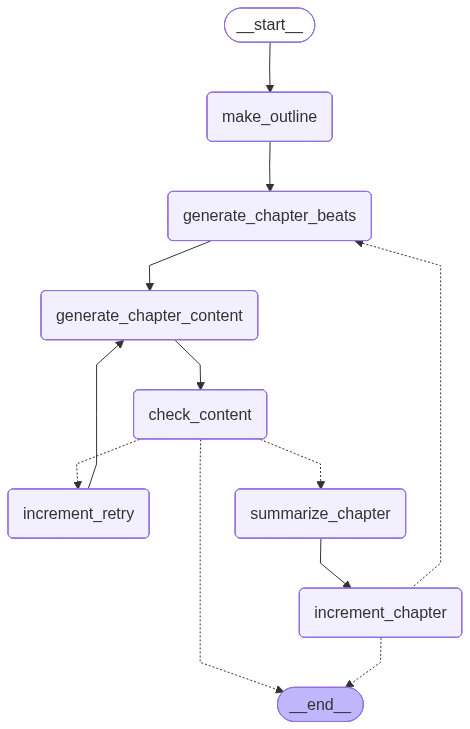

# Story Agent

A psychological / personal-journey story generation system demonstrating multi-agent orchestration, production deployment patterns, and agent identity on GCP.

Built with **LangGraph**, **Google ADK**, **Azure OpenAI (GPT-4o)**, and **Postgres** — deployed via **Cloud Run + Pub/Sub**.

---

## What It Does

Given a story premise, the system generates a full narrative chapter by chapter:

1. An outline agent builds a story arc and character breakdown
2. Per chapter: beats agent → content agent → quality check → summarizer → loop
3. Three variants are generated in parallel (Pub/Sub fan-out)
4. An LLM judge (GPT-4o-mini) picks the best variant
5. The winning chapter is stored and a Google Calendar event is booked on the user's behalf (agent-as-user via OAuth)

---

## Project Structure

```
story_agent/
├── src/
│   ├── agents/
│   │   ├── models.py             # Pydantic types: StoryConfig, Outline, Chapter, etc.
│   │   ├── prompts.py            # style guide + all prompt templates
│   │   ├── langgraph_agent.py    # LangGraph orchestrator (StoryAgent class)
│   │   ├── adk_agent.py          # Google ADK orchestrator (Phase 1 comparison)
│   │   ├── README_comparison.md  # LangGraph vs ADK side-by-side
│   │   └── subagents/
│   │       ├── outline.py        # GPT-4o call → Outline Pydantic model
│   │       ├── chapter_beats.py  # GPT-4o call → ChapterBeats Pydantic model
│   │       └── chapter_content.py# GPT-4o call → free-form prose Chapter
│   ├── api/
│   │   └── main.py               # FastAPI: router + worker + OAuth + status routes
│   ├── evaluator/
│   │   └── llm_judge.py          # LLM-as-judge: best-of-N variant selection
│   ├── guardrails/
│   │   └── model_armor.py        # Google Model Armor pre/post LLM screening
│   ├── infra/
│   │   ├── db.py                 # Postgres job store (story_jobs table)
│   │   ├── pubsub_client.py      # Pub/Sub fan-out publisher
│   │   ├── fallback.py           # GPT-4o → GPT-4o-mini fallback on 429s
│   │   └── retry.py              # Exponential backoff with full jitter
│   ├── oauth/
│   │   └── calendar_client.py    # OAuth token management + Google Calendar booking
│   └── ui/
│       └── gradio_app.py         # Gradio frontend for local demo
├── deploy/
│   ├── iam_setup.sh              # Create GCP service accounts + IAM roles
│   ├── deploy_router.sh          # Build image + deploy Cloud Run router
│   └── deploy_worker.sh          # Deploy Cloud Run worker + wire Pub/Sub subscription
├── docs/
│   └── architecture.md           # Local vs production architecture diagrams
├── data/
│   ├── graph.mmd                 # LangGraph graph (auto-generated on each run)
│   ├── graph.png                 # Rendered graph image (auto-generated on each run)
│   ├── langgraph_state.json      # State dump from last LangGraph run
│   └── adk_state.json            # State dump from last ADK run
├── examples/
│   └── gone_home_style.json      # Example StoryConfig input
├── Dockerfile
└── requirements.txt
```

---

## Architecture

See [`docs/architecture.md`](docs/architecture.md) for full diagrams comparing the local setup vs Cloud Run production deployment.

### Local (what runs on your machine)

```
Gradio UI → FastAPI (router + worker in one process) → Local Postgres → Azure OpenAI
```

Three parallel Python threads simulate Pub/Sub fan-out for local development.

### Production (Cloud Run)

```
Browser → Cloud Run router (public) → Pub/Sub → Cloud Run workers x3 (internal) → Cloud SQL → Azure OpenAI
```

Real Pub/Sub push subscription delivers one message per worker container. Workers run in parallel, last one triggers the LLM judge.

### LangGraph Graph

The graph is rendered to `data/graph.mmd` and `data/graph.png` on every run:



---

## Setup

### 1. Python environment

```bash
mkvirtualenv story_agent
workon story_agent
pip install -r requirements.txt
```

### 2. Environment variables

```bash
cp .env.example .env
# Required fields:
# AZURE_OPENAI_ENDPOINT
# AZURE_OPENAI_DEPLOYMENT_NAME
# AZURE_OPENAI_API_KEY
# DB_HOST, DB_PORT, DB_USER, DB_PASSWORD, DB_NAME
# GOOGLE_CLOUD_PROJECT (for Secret Manager + Model Armor)
# OAUTH_CLIENT_ID, OAUTH_CLIENT_SECRET, OAUTH_REDIRECT_URI
```

### 3. Postgres

```bash
createdb game_stories
psql "postgresql://${DB_USER}@${DB_HOST}:${DB_PORT}/${DB_NAME}" -c "SELECT 1;"
```

`PostgresSaver.setup()` creates LangGraph checkpoint tables on first run automatically.

---

## Running

### LangGraph agent (direct)

```bash
# Fresh story
python -m src.agents.langgraph_agent \
    --config examples/gone_home_style.json \
    --thread-id demo-1

# Resume from last checkpoint (same thread-id)
python -m src.agents.langgraph_agent \
    --config examples/gone_home_style.json \
    --thread-id demo-1
```

### ADK agent (Phase 1 comparison)

```bash
python -m src.agents.adk_agent \
    --config examples/gone_home_style.json \
    --session-id demo-1
```

### Full API + Gradio demo

```bash
# Terminal 1 — API server
uvicorn src.api.main:app --reload --port 8000

# Terminal 2 — Gradio UI
python -m src.ui.gradio_app
```

Open [http://localhost:7860](http://localhost:7860), fill in the form, click Generate. Three parallel workers run, the judge picks the best chapter, and the result appears in the output box.

### OAuth flow (one-time per user)

```bash
# Start the API server, then visit:
open http://localhost:8000/auth/login
# Authorize → refresh token stored in GCP Secret Manager
```

---

## Phase Summary

| Phase | What was built |
|---|---|
| Phase 1 | LangGraph + ADK orchestrators, state management, Postgres persistence, node-level resume |
| Phase 2 | OAuth 2.0 flow, Secret Manager for refresh tokens, Google Calendar booking (agent-as-user) |
| Phase 3 | FastAPI router + worker, Pub/Sub fan-out, LLM judge, Model Armor guardrails, Cloud Run deploy scripts |

---

## Key Design Decisions

- **LangGraph for production** — node-level checkpointing means a rate-limit error mid-chapter resumes from the last node, not the top
- **Best-of-N with judge** — GPT-4o generates 3 variants in parallel; GPT-4o-mini judges (different model eliminates self-preference bias; shuffled order kills position bias)
- **Three service accounts** — router (publish only), worker (LLM + secrets + DB), pubsub-invoker (invoke worker URL only) — least privilege throughout
- **SELECT FOR UPDATE** — Postgres row lock ensures exactly one of the 3 parallel workers triggers the judge, no distributed coordination needed
- **`asyncio.to_thread`** — synchronous LangGraph agent runs in a thread pool so FastAPI's event loop stays free to accept all 3 parallel worker requests

---

## LangGraph vs ADK

See [`src/agents/README_comparison.md`](src/agents/README_comparison.md) for a full side-by-side comparison of state management, persistence, loop control, observability, and resume behavior.
